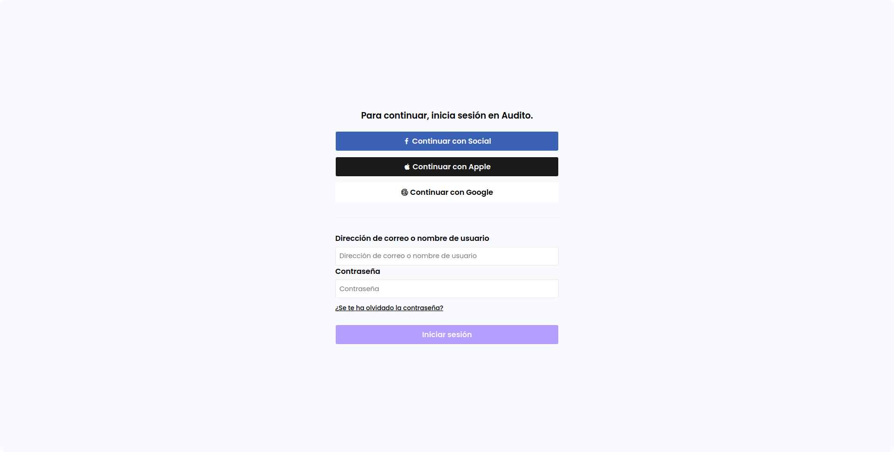
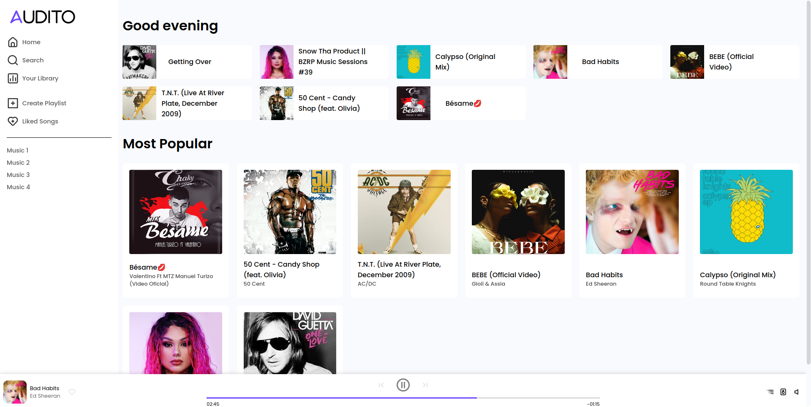
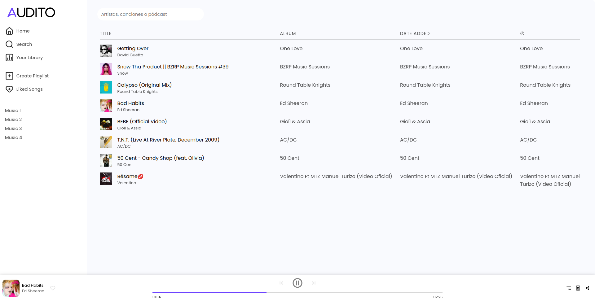

# Audito

This project was generated with [Angular CLI](https://github.com/angular/angular-cli) version 14.2.8.

## Development server

Run `ng serve` for a dev server. Navigate to `http://localhost:4200/`. The application will automatically reload if you change any of the source files.

## Running unit tests

Run `ng test` to execute the unit tests via [Karma](https://karma-runner.github.io).

## Gallery

### Login

### Home

### History

